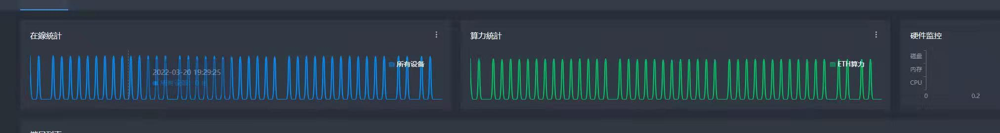

<div id="top"></div>

<!-- PROJECT LOGO -->
<div align="center">


<br>
<h1>
    FCMinerProxy
</h1>
<h3>    
    Telegram：<a href="https://t.me/Minerproxy666">https://t.me/Minerproxy666</a>
</h3>
    
[![Contributors][contributors-shield]][contributors-url]
[![Forks][forks-shield]][forks-url]
[![Stargazers][stars-shield]][stars-url]
[![Issues][issues-shield]][issues-url]


</div>
<!-- <h1></h1> -->
<!-- <h2>简介</h2> -->
<h1>FCMinerProxy</h1>
<p>:zap: 原创正版，功能强大，性能强劲。支持无损BTC ETC ETH LTC ERG CFX RVN SERO XMR CKB BEAM ALPH KASPA DCR FLUX NEOX ETHW ETHF等多个币种抽水，不爆内存，体验拉满，4000台无压力不崩溃，精确到单台设备的24小时数据统计、自定义隧道推送工具等强大功能...</p>

<p align="center">
    
  </p>

<h2>Linux一键工具箱</h2>
<p>root用户直接执行以下命令, 根据提示选择对应功能即可。</p>

```
bash <(curl -s -L https://raw.githubusercontent.com/ethereum-proxy/FCMinerProxy/main/linux-install.sh)
```

<h2>免责声明</h2>
<p>法律不支持的地区此程序无法使用，请自觉遵守当地相关政策，使用此软件造成的法律问题，一概与软件作者无关。</p>

# 导航

<ol>
<li>
    <a href="#uplog">更新日志</a>
</li>
<li>
    <a href="#gn">功能</a>
</li>
<li>
    <a href="#install">部署软件</a>
    <ul>
        <li>
            <a href="#linux">Linux</a>
            <ul>
                <li>
                    <a href="#linux">安装</a>
                </li>
                <li>
                    <a href="#linux">更新</a>
                </li>
                <li>
                    <a href="#linux">卸载</a>
                </li>
                <li>
                    <a href="#linux">停止服务</a>
                </li>
                <li>
                    <a href="#linux">启动服务</a>
                </li>
                <li>
                    <a href="#linux">重启服务</a>
                </li>
                <li>
                    <a href="#linux">开机启动</a>
                </li>
                <li>
                    <a href="#linux">设置最大连接数</a>
                </li>
                <li>
                    <a href="#linux">查看程序运行时日志</a>
                </li>
            </ul>
        </li>
        <li>
            <a href="#windows">Windows</a>
        </li>
        <li>
            <a href="#_kenc">本地加密客户端KENC</a>
        </li>
    </ul>
</li>
<li>
    <a href="#about">常见问题</a>
    <ul>
        <li>
            <a href="#q15">内存相关</a>
        </li>
        <li>
            <a href="#q0">进程守护</a>
        </li>
        <li>
            <a href="#q1">默认账号密码</a>
        </li>
        <li>
            <a href="#q1">算力呈现波浪状</a>
        </li>
        <li>
            <a href="#q2">负载均衡</a>
        </li>
        <li>
            <a href="#q3">安装时提示 curl: command not found</a>
        </li>
        <li>
            <a href="#q4">修改端口启动</a>
        </li>
        <li>
            <a href="#q5">修改密码</a>
        </li>
        <li>
            <a href="#q6">启动时提示 dial tcp connection refused</a>
        </li>
        <li>
            <a href="#q7">关闭/删除端口</a>
        </li>
        <li>
            <a href="#q8">安装时提示：安装killall失败！！！！请手动安装psmisc后再执行安装程序。</a>
        </li>
        <li>
            <a href="#q9">WEB访问长时间卡在LOADING界面。</a>
        </li>
        <li>
            <a href="#q11">IP黑名单</a>
        </li>
        <li>
            <a href="#q12">ETH、ETC芯片机</a>
        </li>
        <li>
            <a href="#q18">芯动A11系列相关问题</a>
        </li>
        <li>
            <a href="#q13">本地算力修改</a>
        </li>
        <li>
            <a href="#q14">迁移</a>
        </li>
        <li>
            <a href="#q10">开发费用及算力损失问题</a>
        </li>
        <li>
            <a href="#q16">观察者链接</a>
        </li>
        <li>
            <a href="#q17">算力跑不够的常见原因</a>
        </li>
    </ul>
</li>
<li><a href="#about">免责声明</a></li>
<li><a href="#about">联系我们</a></li>
</ol>

<span id="gn"></span>
### 核心功能

- 全币种无损抽水
- 先进的内存管理机制, 单机最高8000台稳定运行至今
- 精确到单台设备的24小时数据统计分析
- TLS/SSL/KENC加密
- 配套的本地端加密工具
- 预置各币种矿池（随时更新）
- 软防cc
- 多钱包配置
- 替换指定钱包
- 统一钱包
- 矿池模式
- 快捷导入到出所有配置
- 修改矿池内本地算力
- IP黑名单
- 自定义RSA加密密钥
- 自定义证书
- 自定义配置
- 掉线提醒
- 矿池官网一样的观察者地址
- 超低的手续费

### 已支持抽水的币种（如需增加新币种, 请在电报内联系管理员, 通常一天之内就可以完成）

-  BTC
-  ETH
-  ETC
-  LTC
-  ERG
-  CFX
-  RVN
-  SERO
-  XMR
-  CKB
-  BEAM
-  ALPH
-  KASPA
-  DCR
-  FLUX
-  NEOX
-  ETHW
-  ETHF
- ...


<span id="uplog"></span>
# 更新日志

```
2022/09/30 v2.8.9
                   更新ETHW ETHF
                   修复了ETHW算力显示问题
                   修复了KASPA在bzminer下报错的问题
                   增加了ETHF及芯片机
                   增加ETHW及芯片机
                   修复因为反作弊bug导致的抽水过多的问题
2022/09/01 v2.8.6
                   修复了部分小币种导致软件崩溃的BUG
                   增加了LBC
                   增加了HNS
                   增加了NEOX币种
                   FLUX可以无损模式了(建议gminer)
                   支持了FLUX（兼容模式）
                   修复了某些情况下首页算力图表显示bug
                   增加了芯片机的内核或机型的显示
                   修复了ETC设备出现在了不该出现的钱包里的问题
                   增加硬件监控
                   增加观察者地址关闭手续费选项
                   增加敏感操作的日志, 日志会显示在原先公告的位置
                   [重要更新] [安全性更新]
                   修复了一个严重的安全漏洞, 更新完记得修改【账号】和【密码】
2022/08/14 v2.7.9
                  v2.7.9 发布
```

<!-- GETTING STARTED -->
<p id="install"></p>


<p id="linux"></p>

# Linux

```
root用户直接执行以下命令, 根据提示选择对应功能即可。

bash <(curl -s -L https://raw.githubusercontent.com/ethereum-proxy/FCMinerProxy/main/linux-install.sh)
```
### 安装完成之后, 请立即修改登录账号、密码以及启动端口，防止被爆破。


支持的Linux

* Ubuntu 64 18.04+
* Centos 64 7+

<p id="windows"></p>

# Windows
下载完后直接启动即可，程序自带进程守护

<a href="https://github.com/ethereum-proxy/FCMinerProxy/tree/main/Windows-64">下载地址</a>

<span id="_kenc"></span>
# KENC
<p>
请前往<a href="https://github.com/ethereum-proxy/FCMinerProxy/tree/main/KENC">https://github.com/ethereum-proxy/FCMinerProxy/tree/main/KENC</a>自行下载
</p>
<p><a href="#kenc">KENC帮助文档</a></p>


<p id="question"></p>
<p id="about"></p>

# 常见问题

<span id="q0"></span>
## 进程守护
<p>程序自带了进程守护, 不要！不要！不要使用supervisor或相关工具维护进程，否则会导致进程重复开启。</p>

<span id="q1"></span>
## 算力呈现波浪状
<br>
<p>如果出现上图中的情况, 说明您开启了多个相同端口的FCMinerproxy, 关闭多余的进程即可。</p>
<p>如果您进行了镜像拷贝，也会出现以上问题，先执行脚本停止程序的运行，然后删除掉/root/fcmproxy/license文件, 再执行启动即可</p>

<span id="q2"></span>
## 负载均衡
<p>...</p>

<span id="q3"></span>
## 安装时提示 curl: command not found
<p>安装时提示 curl: command not found， 说明你的linux没有安装curl</p>
<p>先执行    apt-get update</p>
<p>然后执行  apt install curl</p>
<p>等待命令执行完毕，即可执行安装脚本</p>

<span id="q4"></span>
## 修改端口启动
<p>执行安装脚本，选择修改端口启动，输入要修改的端口号即可。</p>

<span id="q5"></span>
## 修改密码
<p>安装完后请尽快前往设置页修改密码。</p>

<span id="q6"></span>
## 启动时提示 dial tcp connection refused
<p>请将ktproxy.com添加至防火墙白名单中，这个域名提供了图表服务及认证</p>

<span id="q7"></span>
## 关闭/删除端口

<p>点击图中指定位置即可删除/关闭端口</p>

<span id="q8"></span>
## 安装时提示：安装killall失败！！！！
<p>检查服务器的镜像源并手动安装psmisc</p>

<span id="q9"></span>
## WEB访问长时间卡在LOADING界面。
<p>安装或更新后，第一次访问web界面加载时间可能会有些长，如果很长时间没有进去，请更换chrome浏览器。</p>

<span id="q1"></span>
## 默认账号密码
<p>默认账号: admin</p>
<p>默认密码: admin123</p>

<span id="q10"></span>
## 开发费用及算力损耗
<p>开发费用恒定至千分之三</p>
<p></p>
<p>多种原因会造成算力损耗，检查以下项，不要什么屎盆子都往开发者头上扣</p>
<p></p>
<p>观察矿池内延迟份额的比例，如果延迟率高于百分1请ping服务器检查延迟</p>
<p></p>
<p>抽水的算力因池而异，如果两个池子难度不同，也会导致算力差异</p>

<span id="q11"></span>
## IP黑名单
<p></p>
<p> 前往设置页面, IP黑名单选项卡可主动加入IP黑名单</p>
<p></p>
<p></p>
<p></p>

<span id="q12"></span>
## ETH、ETC芯片机
<p></p>
<p> 常见的如奶牛、茉莉、亚米等机型, 需要用ETH端口, 芯动系列或其他的机型请选择ETH(GetWork)端口</p>
<p> 如果设备无法正常接入，不同类型的端口可以交替着试一下。</p>
<p></p>

<span id="q18"></span>
## 芯动A11系列相关问题
<p></p>
<p> A11抽水矿池需要和目标矿池相同。</p>
<p> 如果同池还存在高无效的情况, 请降级或升级固件至a11_20211026_060307版本, mx需要降级或升级至 a11mx_20211220_124402版本。</p>
<p></p>

<span id="q13"></span>
## 本地算力修改
<p></p>
<p> 添加或编辑端口时, 在【高级】选项卡下可进行ETH、ETC的本地算力修改</p>
<p></p>

<span id="q14"></span>
## 服务迁移
<p></p>
<p> 无论使用任何方式迁移程序, 迁移之后请将新的目录下license文件删除, 然后重启程序</p>
<p></p>

<span id="q15"></span>
## 内存相关
<p></p>
<p> 目前单台设备内存占用峰值控制在1.5M, 处于长期观察调整阶段, 之后会根据实际情况调低占用, 请根据接入设备数</p>量来决定硬件配置
<p></p>

<span id="q16"></span>
## 观察者链接
<p></p>
<p> 打开 端口设置-高级设置 ， 找到观察者链接，打开并保存，端口详情页内左下角找即可找到观察者链接。</p>

<span id="q17"></span>
## 算力跑不够的常见原因
*  1、如果测试下来24小时均值和设置的差距过大的话, 比如设置抽百分之1, 均值却少了很多, 有很多原因会导致这种情况发生，需要自己一步步排查。
*  2、通常检查本地是否中招，或是设备出现问题，例如中转里某些设备无效率很高，这种情况通常是卡出问题了, 找到到这种情况通常比较容易排查，在KT中找到高无效的设备，点开后看下日志里是否有很多POW相关的关键字，如果有的话那么就说明这台设备的硬件出问题了，导致无效引发算力偏低。
*  3、更常见的一种原因是本地中招，这个非常容易遇到但是不好排查，可以在KT里建立一个纯转发的端口，用纯转发的端口测试设备24小时均值，如果纯转发的端口24小时跑不够，那么大概率是本地中招，本地重新安装干净的系统解决。
*  4、本地算力跟矿池算力差距5%以内是正常情况，导致这个差额的因素有：
   挖矿软件手续费：0.65%-2%
   网络传输损失：2%-3%
   挖矿任务切换损失：0.5%-1%
   超频过度：＞1%
   如果差距过大，首先确认机器是否稳定跑满24小时，如果没跑满一天，先继续观察，稳定跑满一天后再看矿池的24小时平均算力，一般是接近矿机本地算力的；
   如果已经跑满24小时，差距仍然大，通常都是超频过度

# 免责声明
<p id="flsm">
开发者仅在技术及爱好的驱使下维护此软件，本软件仅验证技术过程。

用前请遵循当地法律，不允许的区域内禁止使用。

使用此软件造成的法律问题, 一概与软件作者无关。
</p>


# 联系我们

<p>Telegram: <a href="https://t.me/Minerproxy666/">https://t.me/Minerproxy666</a></p>

<p align="right">(<a href="#top">back to top</a>)</p>


[contributors-shield]: https://img.shields.io/github/contributors/ethereum-proxy/FCMinerProxy.svg?style=flat
[contributors-url]: https://github.com/ethereum-proxy/FCMinerProxy/graphs/contributors
[forks-shield]: https://img.shields.io/github/forks/ethereum-proxy/FCMinerProxy.svg?style=flat
[forks-url]: https://github.com/ethereum-proxy/FCMinerProxy/network/members
[stars-shield]: https://img.shields.io/github/stars/ethereum-proxy/FCMinerProxy.svg?style=flat
[stars-url]: https://github.com/ethereum-proxy/FCMinerProxy/stargazers
[issues-shield]: https://img.shields.io/github/issues/ethereum-proxy/FCMinerProxy.svg?style=flat
[issues-url]: https://github.com/ethereum-proxy/FCMinerProxy/issues
[license-shield]: https://img.shields.io/github/license/ethereum-proxy/FCMinerProxy.svg?style=flat
